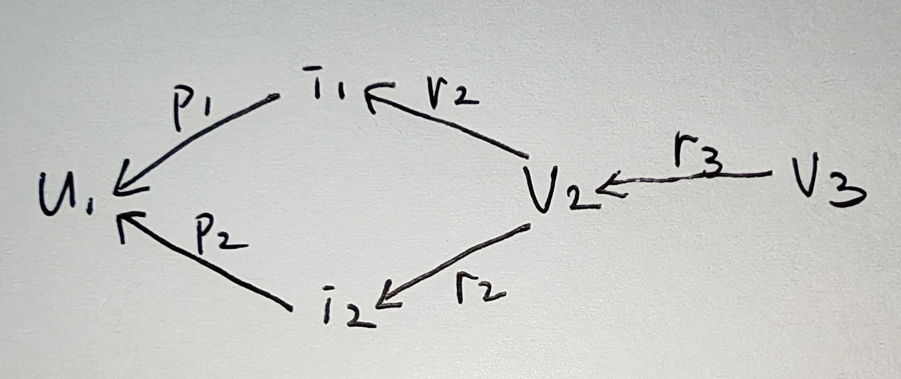

# **精读笔记**

## 快速总结

KGIN 将用户意图（Intent）和关系路径（Relational Path）显式引入知识图谱推荐，在保持 GNN 框架的同时显著增强了关系语义建模能力和模型可解释性

### 核心贡献

1. 揭示基于知识图谱的推荐中用户交互背后的意图，以提升模型的性能和可解释性
2. 提出一种新的模型 KGIN，在图神经网络范式下，从意图的细粒度以及关系路径的长距离语义层面考虑用户与物品之间的关系
3. 在三个基准数据集上开展实证研究，以证明 KGIN 的优越性

## 研究背景

在进行推荐时，不仅要考虑用户-物品交互和知识图谱中的实体关系，还应进一步挖掘用户交互背后的潜在意图以及关系路径所蕴含的语义信息

例如，不同用户可能因为导演、演员、类型等不同意图选择同一部电影，而知识图谱中的关系路径也能够刻画实体之间更丰富的关联语义

### 现有方法

| 名称              | 解释                                                         | 缺陷                                                         | 参考文献 |
| ----------------- | ------------------------------------------------------------ | ------------------------------------------------------------ | -------- |
| [[2019_KDD_KGAT]] | 基于 GNN 的知识图谱推荐模型，通过注意力机制传播 KG 中多跳邻居信息，联合学习用户与物品表示 | 1. 未建模用户意图（User Intent） 2. 聚合方式以节点为中心，忽略关系路径语义 3. 关系主要作为邻接权重，无法建模关系间依赖 | [41]     |
| KGNN-LS           | 基于知识图谱神经网络，对用户交互物品的 KG 邻域进行扩散聚合，引入 Label Smoothness 缓解噪声传播 | 1. 未区分不同用户意图 2. 聚合的是邻居节点而非关系路径 3. 长距离关系语义利用不足 | [38]     |
| CKAN              | 将协同过滤知识与 KG 知识统一建模，采用协同知识感知网络学习用户—物品表示，实现端到端推荐 | 1. 未显式建模用户潜在意图 2. 未建模关系路径上的语义依赖 3. 关系信息主要用于增强节点表示 | [47]     |
| KTUP              | 将每个意图与一个知识图谱（KG）关系耦合                       | 仅孤立地考虑单个关系，未考虑 关系之间的交互与组合            | [4]      |

### KGIN

1. 用户意图建模（User Intent Modeling）
   * 一个用户通常具有多个潜在意图（Intent），不同 Intent 驱动不同的交互行为
   * 每个 Intent 表示为多个 KG Relation 的加权组合
   * 引入独立性约束（Independence Constraint），使不同 Intent 学到不同语义，提高可解释性
2. 关系路径感知聚合（Relational Path-aware Aggregation）
   * 将 **关系路径（Relation Path）** 而非节点视为信息传播单元
   * 显式建模路径上的关系顺序及关系依赖
   * 分别设计用户行为图和知识图谱的聚合策略，同时学习用户行为模式与实体关联语义

## 方法论

### 符号表

| 符号                                                 | 含义                                                         |
| ---------------------------------------------------- | ------------------------------------------------------------ |
| $U$                                                  | 用户集合                                                     |
| $I$                                                  | 物品集合                                                     |
| $V$                                                  | 实体集合（$I \subset V$，实体为物品画像，为交互数据提供补充信息） |
| $R$                                                  | 关系集合                                                     |
| $G = \{(h, r, t) | h, t \in V, r \in R\}$            | 知识图谱                                                     |
| $P$                                                  | **所有用户共享的** 意图集合                                  |
| $N_u = \{(p, i) | (u, p, i) \in IG\}$                | 用户 $u$ 的一阶邻接关系                                      |
| $N_i = \{(r, v) | (i, r, v) \in G\}$                 | 物品 $i$ 的属性及其一阶邻接关系                              |
| $O^+ = \{(u, i) | u \in U, i \in I\}$                | 先验交互数据                                                 |
| $O = \{(u, i, j) | (u, i) \in O^+, (u, j) \in O^-\}$ | 训练集                                                       |

| 符号  | 含义          |
| ----- | ------------- |
| $e_r$ | 关系 $r$ 的嵌入 |
| $e_p$ | 意图 $p$ 的嵌入 |
| $e_u^{(l)}$ | 第 $l$ 层用户表示 |
| $e_i^{(l)}$ | 第 $l$ 层物品表示 |
| $w_{rp}$ | 针对特定关系 $r$ 和特定意图 $p$ 的可训练权重 |

| 符号       | 含义                                                         |
| ---------- | ------------------------------------------------------------ |
| $s(\cdot)$ | 衡量任意两个意图表示之间关联程度的函数，此处设为余弦相似度函数 |
| $\tau$     | Softmax 函数中的温度超参数                                   |
| $dCov$     | 两个表示之间的距离协方差                                     |
| $dVar$     | 两个表示之间的距离方差                                       |

### 用户意图建模

不同的意图抽象出用户不同的行为模式，由相似意图驱动的用户会对物品表现出相似的偏好

考虑交互数据 $O^+$，对每对 $(u, i)$ 分解为 $\{(u, p, i) | p \in P\}$，生成异构图 $IG$（intent graph，意图图）

#### 意图的表示学习

使用注意力机制
$$
\begin{align}
e_p &= \sum_{r\in R} \alpha(r, p) e_r \\
\alpha(r, p) &= \cfrac{\exp{(w_{rp})}}{\sum_{r' \in R} \exp{(w_{r'p})}}
\end{align}
$$

#### 意图的独立性建模

增强不同意图之间的差异性，使这些意图具有清晰的边界，提升用户意图的可解释性

可选的方法有：互信息 [2]、皮尔逊相关性 [33]、距离相关性 [32, 33, 43]

互信息：最小化任意两个不同意图表示之间的互信息，量化独立性（与对比学习一致）
$$
L_{IND} = \sum_{p \in P} -\log{\cfrac{\exp{(s(e_p, e_p) / \tau)}}{\sum_{p' \in P}\exp{(s(e_p, e_p') / \tau)}}}
$$

距离相关性：衡量任意两个变量之间的线性及非线性关联，当且仅当这两个变量相互独立时，其系数为零
$$
\begin{align}
L_{IND} &= \sum_{p, p' \in P,\,\, p \ne p'} dCor(e_p, e_p') \\
dCor(e_p, e_p') &= \cfrac{dCov(e_p, e_p')}{\sqrt{dVar(e_p) \cdot dVar(e_p')}}
\end{align}
$$

### 关系路径感知聚合

传统的 GNN 推荐模型例如 KGAT、KGNN-LS、CKAN 等有统一形式
$$
e_u^{(l)} = Aggregate(e_u^{(l - 1)}, \{e_v^{(l - 1)} | v \in N_u\})
$$
即不断聚合邻居节点表示，作者认为其存在两个问题

1. 不知道消息来自哪条路径：$u_1 \leftarrow v_2$，传统 GNN 只知道 $v_2$ 是二跳邻居，而不知道是通过哪条关系路径到达的
2. 关系只是注意力权重：KGAT 中，关系 $r$ 决定注意力权重，而本身没有真正进入 embedding，不参与学习

#### 意图图上的聚合层

基于意图图 $IG$，计算用户 $u$ 在第一层图神经网络上的嵌入表示
$$
\begin{align}
e_u^{(1)} &= f_{IG}\left(\{(e_u^{(0)}, e_p, e_i^{(0)}) | (p, i) \in N_u\}\right) \\
&= \cfrac{1}{|N_u|} \sum_{(p, i) \in N_u} \beta(u, p) e_p \odot e_i^{(0)} \\
\beta(u, p) &= \cfrac{\exp{(e_p^Te_u^{(0)})}}{\sum_{p' \in P} \exp{(e_{p'}^Te_u^{(0)})}}
\end{align}
$$

#### 知识图谱上的聚合层

基于知识图谱 $KG$，计算物品 $i$ 在第一层图神经网络上的嵌入表示
$$
\begin{align}
e_i^{(1)} &= f_{KG} \left(\{(e_i^{(0)}, e_r, e_v^{(0)}) | (r, v) \in N_i \}\right) \\
&= \cfrac{1}{|N_i|} \sum_{(r, v) \in N_i} e_r \odot e_v^{(0)}
\end{align}
$$

意图图上的聚合层和知识图谱上的聚合层明显没有注意力，因为在 KGAT 中关系只是控制传播多少，而 KGIN 将关系嵌入直接融入消息构造 $e_r \odot e_v^{(0)}$，使关系不仅控制传播强度，还参与节点表示学习

#### 多层传播

有了一层之后，继续传播
$$
\begin{align}
e_u^{(l)} &= f_{IG} \left(\{(e_u^{(l - 1)}, e_p, e_i^{(l - 1)}) | (p, i) \in N_u\}\right) \\
e_i^{(l)} &= f_{KG} \left(\{(e_i^{(l - 1)}, e_r, e_v^{(l - 1)}) | (r, v) \in N_i\}\right)
\end{align}
$$

#### 如何捕获关系路径

例如一个 $l$ 跳的关系路径
$$
s = i \xrightarrow{r_1} s_1 \xrightarrow{r_2} \cdots \xrightarrow{r_l} s_l
$$

第一层，有
$$
e_i^{(1)} = \cfrac1{|N_i|} \sum_{(r, v)\in N_i} e_r\odot e_v^{(0)}
$$
第二层，由于 $e_{s_1}^{(1)} = \cfrac1{|N_{s_1}|} \sum_{(r_2,s_2)\in N_{s_1}} e_{r_2} \odot e_{s_2}^{(0)}$，有
$$
\begin{align}
e_i^{(2)} &= \cfrac1{|N_i|} \sum_{(r_1, s_1)\in N_i} e_{r_1} \odot e_{s_1}^{(1)} \\
&= \cfrac1{|N_i|} \sum_{(r_1, s_1)\in N_i} e_{r_1} \odot \left(\cfrac1{|N_{s_1}|} \sum_{(r_2, s_2)\in N_{s_1}} e_{r_2} \odot e_{s_2}^{(0)}\right) \\
&= \cfrac1{|N_i|} \sum_{(r_1, s_1)} \sum_{(r_2, s_2)} \cfrac{e_{r_1}}{|N_{s_1}|} \odot e_{r_2} \odot e_{s_2}^{(0)}
\end{align}
$$
第三层，由于 $e_{s_2}^{(2)} = \cfrac1{|N_{s_2}|} \sum_{(r_3,s_3)} e_{r_3} \odot e_{s_3}^{(0)}$，有

$$
e_i^{(3)} = \frac1{|N_i|} \sum \frac{e_{r_1}}{|N_{s_1}|} \odot \frac{e_{r_2}}{|N_{s_2}|} \odot e_{r_3} \odot e_{s_3}^{(0)}
$$
第 $l$ 层，同理
$$
e_i^{(l)} = \sum_{s\in N_i^l} \frac{e_{r_1}}{|N_{s_1}|} \odot \frac{e_{r_2}}{|N_{s_2}|} \odot \cdots \odot \frac{e_{r_l}}{|N_{s_l}|} \odot e_{s_l}^{(0)}
$$
其中，$N_i^{l}$ 是所有从 $i$ 出发长度为 $l$ 的路径集合

式中 $e_{r_1} \odot e_{r_2} \odot \cdots \odot e_{r_l}$ 说明整个关系序列共同决定最终 embedding

即关系路径（Relational Path）被视为一条 **信息传播通道（Information Channel）**，而不是仅仅将不同路径上的节点统一聚合

### 模型预测

$$
\begin{align}
e_u^* &= \sum_{l = 0}^L e_u^{(l)} \\
e_i^* &= \sum_{l = 0}^L e_i^{(l)} \\
\hat{y}_{u_i} &= {e_u^*}^{T}e_i^*
\end{align}
$$

### 模型训练

使用 BPR 损失，对于正样本 $i$ 和负样本 $j$，有
$$
L_{BPR} = \sum_{(u, i, j) \in O} -\ln{\sigma(\hat{y}_{ui} - \hat{y}_{uj})}
$$
模型总损失为
$$
L_{KGIN} = L_{BPR} + \lambda_1 L_{IND} + \lambda_2 ||\Theta||_2^2
$$
