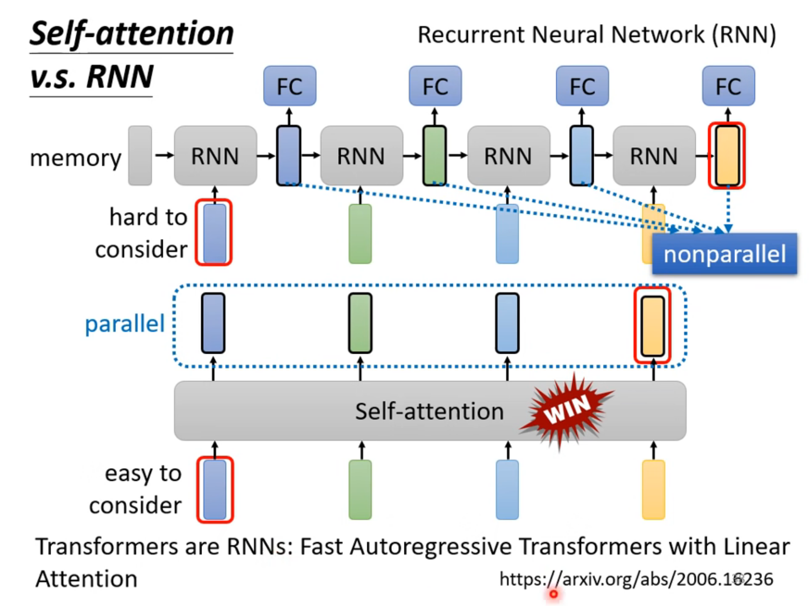
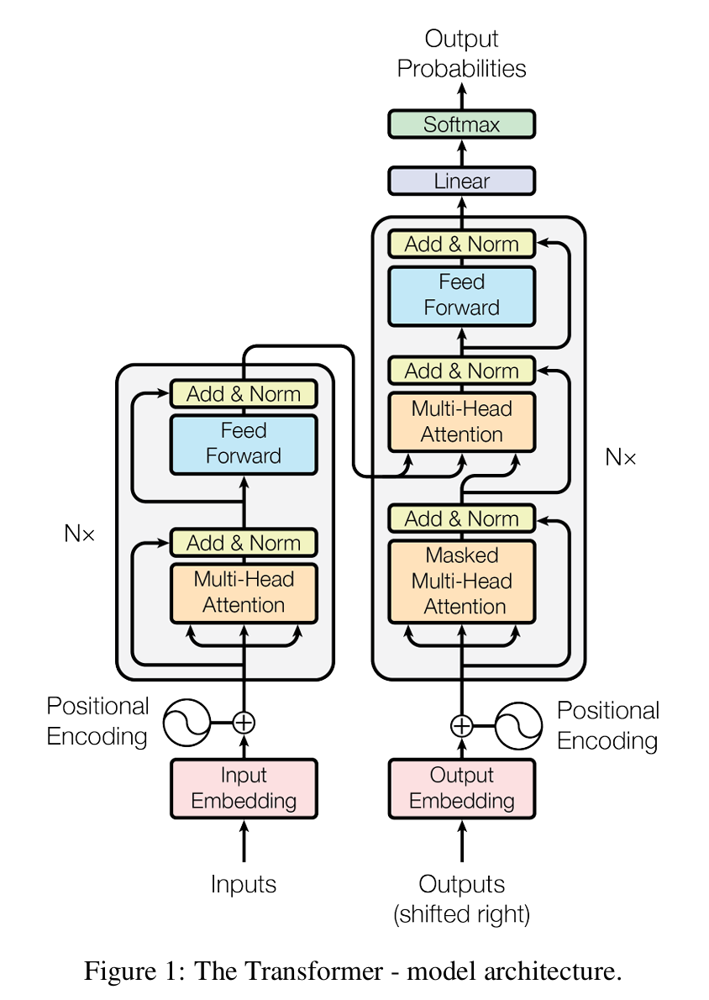
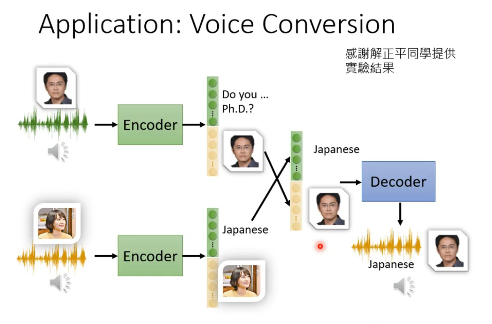
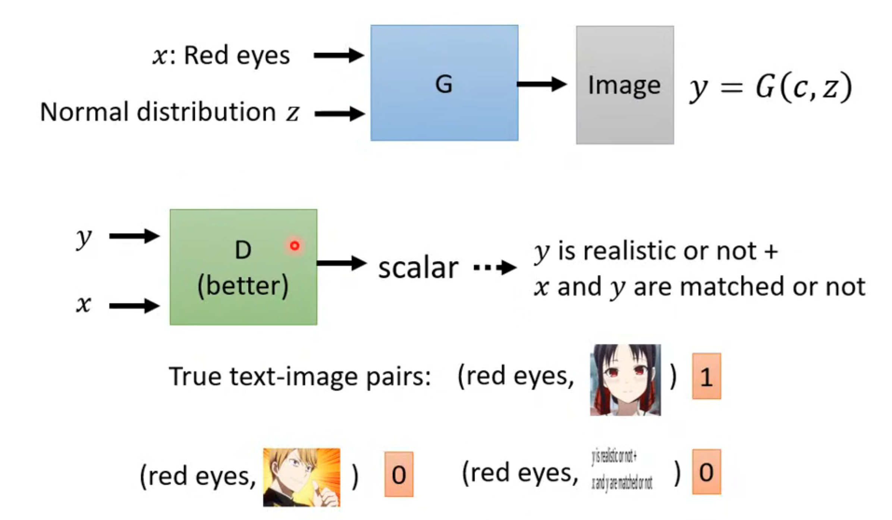
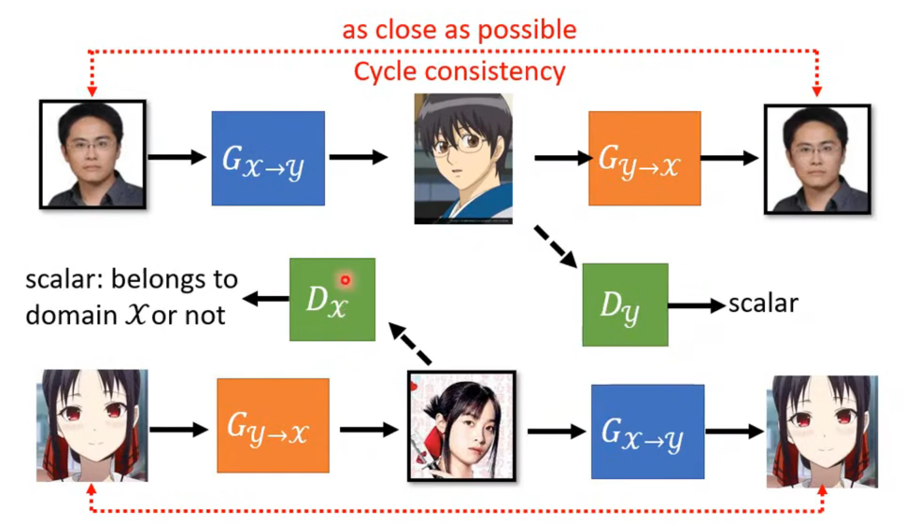
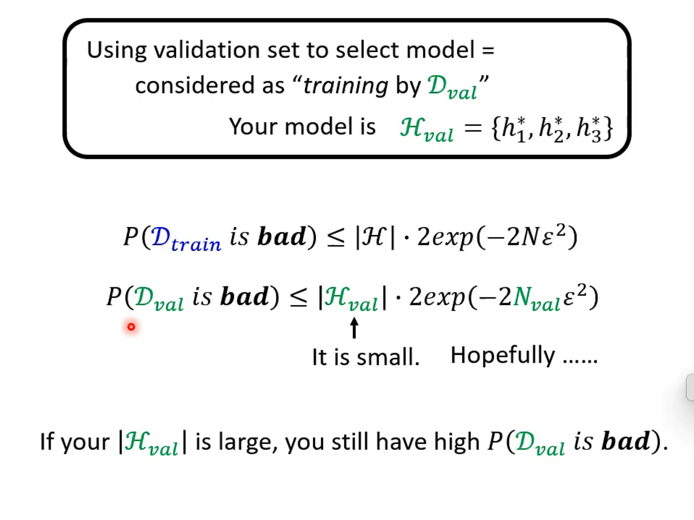

# **CNN**

## 基本概念

### CNN 与全连接神经网络的区别

* 全连接（Fully Connected Layer, FC Layer）拥有最高的自由度，参数量巨大，但容易忽略图像的局部相关性
* 在计算机视觉领域，观察图片的边缘、纹理等局部模式（Pattern）即可有很好的效果，且同一种模式可能出现在图像不同位置
* CNN 通过设置感受野（Receptive Field）和参数共享（Parameter Sharing）在全图复用同一组卷积核（Convolution Kernel / Filter）作为特征检测器（Feature Detector）。使得 **同一种特征在任何位置都能被识别**
* 降低参数数量，提升泛化能力

### CNN 流程

- 图片被处理为 Tensor
- 输入 Tensor shape 为 $(3,224,224)$，使用 64 个大小为 $ 3\times3 $ 的卷积核，以 $stride=1$ 进行 **卷积**（Convolution）
  - 若不使用 $padding$，则输出 shape 为 $(64,222,222)$
  - 若使用 $padding=1$，则输出 shape 为 $(64,224,224)$
- 注意到，输出 Tensor 的通道数由卷积核数量决定，即 64 个卷积核会生成 64 个特征图（Feature Map），每个特征图可能专注于某个特征。下一层将所有特征图整体当作输入。
- 接着使用 **池化**（Pooling），例如将卷积结果按 $2\times2$ 区域分组，并取每组最大值（Max Pooling）或平均值（Average Pooling）作为该区域的代表，生成新的 Tensor
- 注意到，池化操作会减小 Tensor 的空间尺寸（Height / Width），降低计算量，并且增强模型对图像特征局部平移的鲁棒性

经过若干卷积层与池化层（可选）交替后，CNN 会逐步提取高层语义特征并压缩空间尺寸。随后将特征 Tensor 展平（Flatten）或通过全局池化（Global Pooling）转换为向量，再经过若干全连接层（Fully Connected Layer）输出 logits，并通过 `Softmax ` 转换为类别概率，从而完成图像分类任务

### 为什么选择 CNN

* 图像特征具有局部相关性（Locality）
* 同一种特征可能出现在不同空间位置（Translation Sharing）

### STN

STN（Spatial Transformer Network）用于增强 CNN 对几何变换（如平移、旋转、缩放、倾斜等）的鲁棒性

本质是一个可学习的几何变换模块，自动学习目标位置、旋转/缩放参数、自动将目标摆正，再交给 CNN 处理

## 模型架构代码

```python
class ConvBlock(nn.Module):
    def __init__(self, in_channels, out_channels):
        super().__init__()
        self.block = nn.Sequential(
            nn.Conv2d(in_channels, out_channels, kernel_size=3, padding=1),
            nn.BatchNorm2d(out_channels),
            nn.ReLU(inplace=True),
            nn.MaxPool2d(kernel_size=2, stride=2),
        )

    def forward(self, x):
        return self.block(x)


class FoodCnn(nn.Module):
    def __init__(self):
        super().__init__()
        self.cnn = nn.Sequential(
            ConvBlock(3, 64),
            ConvBlock(64, 128),
            ConvBlock(128, 256),
            ConvBlock(256, 512),
            ConvBlock(512, 512),
        )
        self.fc = nn.Sequential(
            nn.Linear(512 * 4 * 4, 1024),
            nn.ReLU(),
            nn.Linear(1024, 512),
            nn.ReLU(),
            nn.Linear(512, 11),
        )
        
    def forward(self, x):
        out = self.cnn(x)
        out = torch.flatten(out, 1)
        return self.fc(out)
```

# **RNN**

## 基本概念

RNN 用来处理输入是一组向量的情况

例如：Token 经由词嵌入（Word Embedding）后转变为向量，文本则为 **一组向量**；语音可以被编码为 **一组向量**；Graph 中的每个结点信息表示为向量，结点集为 **一组向量**

### RNN 流程

以序列标注任务为例，其对句子中的每一个 token 进行分类


| 符号       | 含义                                                         |
| ---------- | ------------------------------------------------------------ |
| $x^t$      | 第 $t$ 个输入向量                                            |
| $a^t$      | 第 $t$ 个 hidden state（memory，RNN 在时刻 $t$ 对历史信息的压缩记忆） |
| $\hat y^t$ | 第 $t$ 个预测输出（通常为分类概率分布）                      |
| $y^t$      | 第 $t$ 个真实标签（one-hot 向量）                            |
| $W^i$      | 输入到 hidden state 的权重矩阵                               |
| $U$        | hidden state 到 hidden state 的循环权重矩阵                  |
| $V$        | hidden state 到输出层的权重矩阵                              |
| 蓝色箭头   | hidden state 在时间步之间的传递                              |

文本先 tokenizer 转化为 token 序列，然后 embedding 转化为输入向量 $x^t$

初始化 memory $a^0 = 0$

在循环的时刻 $t$，首先更新 memory（早期 RNN 使用 sigmoid，现代实现中更常使用 tanh，因为其输出为零中心，梯度传播性质更好）
$$
a^t = \tanh\big(W^i x^t + U a^{t-1} + b\big)
$$
接下来输出预测
$$
\hat y^t = \text{softmax}(V a^t + b_y)
$$
使用交叉熵作为损失函数
$$
L^t = - \sum_i y^t_i \log \hat y^t_i
$$
### RNN 训练

前向传播：按时间步顺序传播

时间反向传播（Backpropagation Through Time，BPTT）：梯度从后往前传播，所有时间步共享同一组参数

由于梯度需要跨多个时间步连乘

* 连乘小于 1 容易梯度消失
* 连乘大于 1 容易梯度爆炸

| 问题     | 梯度消失    | 梯度爆炸 |
| -------- | ----------- | -------- |
| 梯度大小 | 趋近 0      | 趋近 ∞   |
| 参数更新 | 几乎停止    | 极度剧烈 |
| 结果     | 学不动      | 训练崩溃 |
| 常见现象 | loss 不下降 | loss NaN |
| 本质     | 连乘 < 1    | 连乘 > 1 |

RNN 训练过程中，梯度消失（Vanishing Gradient）和梯度爆炸（Exploding Gradient）都存在

在梯度爆炸时，成本函数可能存在陡峭悬崖，导致学习曲线难以收敛

### 双向 RNN

正向 RNN 利用当前位置之前的信息，反向 RNN 利用当前位置之后的信息

双向 RNN（Bidirectional RNN）将两者结合，从而同时考虑完整上下文


### 长短期记忆网络

长短期记忆网络（Long Short-Term Memory, LSTM）是 RNN 的一种改进结构，解决普通 RNN 难以学习长距离依赖（Long-Term Dependency）的问题（传统 RNN 在长距离依赖时容易梯度消失）

LSTM 是 RNN 事实上的标准

LSTM 用一种包含门控机制（gate）的循环单元（cell），替代了普通 RNN 中简单的隐藏层神经元更新结构


整体上看如下图，当前输入 $x_t$ 与上一时刻隐藏状态 $h_{t - 1}$ 拼接后，分别与四组可学习参数矩阵进行线性变换，得到不同的门控向量与候选记忆


1. 为什么将 RNN 换成 LSTM？

   >LSTM 可以缓解梯度消失问题

2. 为什么 LSTM 可以缓解梯度消失问题？

   >普通 RNN 的 memory 会不断被新的非线性变换压缩，长期信息在传播中易丢失，从而产生梯度消失问题；
   >
   >LSTM 引入了 Cell State 与门控机制，使历史信息能够在时间维度上更稳定地传播；其中 forget gate 控制旧信息保留多少，input gate 控制新信息写入多少，从而缓解梯度消失问题，因此更容易保留长期记忆

### RNN 的扩展

* Gated Recurrent Unit (GRU)：LSTM 的简化，通过减少门控数量降低参数量与计算复杂度
* IRNN：一些研究表明，使用单位阵（Identity Matrix）初始化循环权重，并结合 ReLU 激活函数的 RNN（如 IRNN），在某些任务上可以获得接近甚至优于 LSTM 的效果

### RNN 的应用

* 输入向量序列，输出一个向量（many-to-one）
  * 情感分析（Sentiment Analysis）
* 输入向量序列，输出比输入序列长度短的向量序列（many-to-many）
  * 语音识别（Speech Recognition）
  * CTC（Connectionist Temporal Classification）用于解决输入与输出序列难以对齐的问题
* 输入向量序列，输出与输入序列长度不同的向量序列（Seq2Seq）

  * RNN Encoder–Decoder：使用 Encoder RNN 将输入序列压缩为一个向量表示（Context Vector），再由 Decoder RNN 根据 Context Vector 逐步生成输出序列，是早期 Seq2Seq 的核心结构
  * 机器翻译（Machine Translation）
  * 句法分析（Syntactic Parsing）：生成句法树（Parse Tree）

# **Self-attention**

## 基本概念

### SA 流程

| 符号  | 含义                                 |
| ----- | ------------------------------------ |
| $I$   | 输入矩阵 $I = (a^1, a^2, \dots, a^n)$，$a^i$ 可以加上位置编码 $e^i$ 作为考虑了位置信息的输入 |
| $W^Q$ | 待学习矩阵                           |
| $W^K$ | 待学习矩阵                           |
| $W^V$ | 待学习矩阵                           |
| $Q$ | $Q = (q^1, q^2, \dots, q^n)$ |
| $K$ | $K = (k^1, k^2, \dots, k^n)$ |
| $V$ | $V = (v^1, v^2, \dots, v^n)$ |
| $d_k$ | $K$ 向量（以及 $Q$ 向量）的维度 |
| $A$ | 注意力得分（Attention Score）$A =\begin{pmatrix}\alpha_{1,1} & \alpha_{1,2} & \cdots & \alpha_{1,n} \\\alpha_{2,1} & \alpha_{2,2} & \cdots & \alpha_{2,n} \\\vdots & \vdots & \ddots & \vdots \\\alpha_{n,1} & \alpha_{n,2} & \cdots & \alpha_{n,n}\end{pmatrix}$ |
| $O$   | 输出矩阵 $O = (b^1, b^2, \dots, b^n)$ |

$n = 4$ 时


向量化后

$$
\begin{align}
Q &= IW^Q \\
K &= IW^K \\
V &= IW^V \\
\end{align} \rightarrow
A = \cfrac{QK^T}{\sqrt{d_k}} \rightarrow
A' = Softmax(A) \rightarrow
O = A'V
$$

注：

1. Softmax 可换成其他激活函数

### SA 与 RNN 区别

Self-attention 与 RNN 功能相似，并逐渐取代 RNN



### SA 与 CNN 关系

SA 是 CNN 的超集

| 特性       | CNN  | Self-Attention |
| ---------- | ---- | -------------- |
| 感受野     | 局部 | 全局           |
| 权重       | 固定 | 动态           |
| 参数共享   | 强   | 较弱           |
| 长距离依赖 | 较弱 | 强             |
| 归纳偏置   | 强   | 较弱           |
| 数据需求   | 较少 | 通常更大       |
| 并行性     | 高   | 高             |

### SA for Graph

Graph 为 SA 提供了结点之间的连接关系（边），从而可以将 Attention 的计算限制在邻接结点之间，这是 GNN 的一种形式

## 各种 attenttion

// TODO

## 模型架构代码

```rust
/// 单头注意力
pub struct DotProductAttention {
    w_q: Linear,
    w_k: Linear,
    w_v: Linear,
    d_sqrt: Tensor,
}

impl DotProductAttention {
    pub fn new(vb: VarBuilder, in_dim: usize, out_dim: usize, device: &Device) -> Result<Self> {
        let w_q = linear_no_bias(in_dim, out_dim, vb.pp("w_q"))?;
        let w_k = linear_no_bias(in_dim, out_dim, vb.pp("w_k"))?;
        let w_v = linear_no_bias(in_dim, out_dim, vb.pp("w_v"))?;
        let d_sqrt = 1f32 / (out_dim as f32).sqrt();
        let d_sqrt = Tensor::new(d_sqrt, device)?;
        Ok(Self {
            w_q,
            w_k,
            w_v,
            d_sqrt,
        })
    }

    pub fn forward(&self, x: &Tensor) -> Result<Tensor> {
        // (bs, seq_len, embedding_dim)
        let q = self.w_q.forward(x)?;
        let k = self.w_k.forward(x)?;
        let v = self.w_v.forward(x)?;
        let atten_score = q.matmul(&k.t()?)?; // (bs, seq_len, seq_len)
        let atten_score = atten_score.broadcast_mul(&self.d_sqrt)?;
        let softmax = ops::softmax(&atten_score, D::Minus1)?;
        let atten_weight = softmax.matmul(&v)?; // (bs, seq_len, embedding_dim)
        Ok(atten_weight)
    }
}
```

# **Transformer**

## 基本概念



### Encoder

Add & Norm：将 Multi-Head Self-Attention 输出与输入做残差（residual）相加，然后进行 Layer Normalization（LayerNorm）

Feed Forward：全连接层

### Decoder

Decoder 遮住中间类似 Encoder

Masked：在 self-attention 的 score 矩阵 $QK^T$ 上应用 causal mask，使得上三角位置被置为 $-\infty$，经过 softmax 后这些位置权重为 $0$，从而保证每个 token 只能关注自身及之前的 token

### 训练

在训练阶段，Decoder 输出每个位置的词表概率分布，并与对应位置真实下一个 token 的 one-hot 向量计算 cross entropy loss，最小化损失函数

类似多分类问题

在训练阶段，使用正确答案（ground truth）作为 decoder 的输入，称为 teacher forcing


# **GNN**

## Graph 基本概念

### 结点度

| 符号  | 含义          |
| ----- | ------------- |
| $E$   | 边数          |
| $N$   | 结点数        |
| $d_i$ | 结点 $i$ 的度 |

* 无向图中 $\bar{d} = \cfrac{1}{N}\sum_{i = 1}^Nd_i = \cfrac{2E}{N}$
* 有向图中 $\bar{d} = \cfrac{E}{N}$，且 $\overline{d^{in}} = \overline{d^{out}}$

## GNN 基本概念

### 图表示学习

由于直接将图输入神经网络有以下问题

1. $O(|V|)$ parameters：过拟合
2. 无法泛化到新结点
3. 不具备“变换不变性”（Permutation Invariance）：即更改邻接矩阵中结点的编号，邻接矩阵完全不同，输出也不同

图表示学习采用将结点映射为低维连续稠密向量（Embedding），再在向量空间中进行学习的方法

目标是：**使 embedding 同时保留结点属性与图结构信息，向量之间的距离可以表明结点在图中的关系**


注：

1. 图神经网络不能过深：若过深，每个结点的计算图趋近于一致，所有结点的 embedding 都会趋于相同（Over-smoothing），因此实际中常使用 2～3 层 GNN
2. 消息传递：结点通过聚合邻接结点的信息来更新自身 embedding 的过程称为消息传递

### GCN

#### 数学表示

图卷积神经网络（GCN）是一类用于学习结点 embedding 向量的图表示学习方法，其核心是

> 通过聚合邻接结点的信息，不断更新结点表示（embedding）

| 符号        | 含义                   |
| ----------- | ---------------------- |
| $x_v$ | 结点 $v$ 的初始属性向量 |
| $h_v^{(k)}$ | 结点 $v$ 在第 $k$ 层的 embedding 表示 |
| $N(v)$ | 结点 $v$ 的邻接结点集 |
| $W_k$ | 第 $k$ 层的可学习权重矩阵 |
| $z_v$ | 结点 $v$ 的最终 embedding（即最后一层输出） |

数学形式为（注意公式是递归的）
$$
\begin{align}
h_v^{(0)} &= x_v \\
h_v^{(k + 1)} &= \sigma \Big( W_k \cfrac{1}{|N(v)|} \sum_{u \in N(v)} h_u^{(k)}\Big) \\
z_v &= h_v^K
\end{align}
$$
这里对邻接结点求平均保证了顺序不变性

向量化后（图中给出了 $H^{(k)}$ 和 $D$ 的定义）


#### 归一化矩阵

$A_{row} = D^{-1}A$ 最大特征值为 1，因此多次传播时数值整体较稳定，不会指数级放大。但矩阵非对称，仅考虑源结点度数

$A_{sym} = D^{-\frac{1}{2}}AD^{-\frac{1}{2}}$，对称矩阵，最大特征值为 $1$，效果最好

加入自环（单位阵），引入自身的信息
$$
\begin{align}
\tilde{A} &= A + I \\
\hat{A} &= D^{-\frac{1}{2}}\tilde{A}D^{-\frac{1}{2}} 
\end{align}
$$
若结点 $i$、$j$ 有边，则归一化后的边权 $\hat{A_{ij}} = \cfrac{1}{\sqrt{d_i}\sqrt{d_j}}$

结点度越小，归一化后的边权越大；结点度越大，其传播的信息会被更强地缩放

$\hat{A}$ 被称为 Normalized Adjacency Matrix，由于最大特征值为 $1$，信息传播在主特征方向上能够保持稳定，不会整体指数爆炸

>证明：$\hat{A}$ 特征值 $\lambda=1$ 时对应特征向量为 $D^{\frac{1}{2}}1$（$1$ 是 all-one vector）
>$$
>\hat{A}D^{\frac{1}{2}}1 = D^{-\frac{1}{2}}AD^{-\frac{1}{2}}D^{\frac{1}{2}}1 = D^{-\frac{1}{2}}A1 = D^{-\frac{1}{2}}D1 = 1\cdot D^{\frac{1}{2}}1
>$$
>其中 $A1 = D1$，因为 $A1$ 表示对邻接矩阵求行和，得到结点度向量，而 $D1$ 对角线元素就是结点度

于是结点更新公式可重新表示如下
$$
h_v^{(k + 1)} = \sigma \Big( W_k D^{-\frac{1}{2}}\tilde{A}D^{-\frac{1}{2}} H^{(k)} \Big)
$$

最终版


#### 训练

传统的图表示学习将结点 embedding 和具体应用的神经网络分开训练，现代 GNN 在训练具体应用的神经网络时也会更新节点 embedding

| 符号     | 含义               |
| -------- | ------------------ |
| $f$      | 分类或回归预测头   |
| $y_v$    | 结点 $v$ 类别 label   |
| $\theta$ | 分类预测头权重系数 |

目标
$$
\min L(y, f(z_v))
$$
使用监督学习，损失函数为
$$
\begin{align}
p_v &= \sigma(z_v^T\theta) \\
L &= -\sum_{v \in V}\big [ y_v \log p_v + (1 - y_v) \log{(1 - p_v}) \big]
\end{align}
$$
// TODO 补非监督学习

#### 优点

1. 归纳式学习：可以泛化到新结点，新结点加入图，直接获得计算图，计算出 embedding
2. 可以获得功能、结构、角色信息，找出难以被挖掘的相似节点
3. 即利用了连接信息，也利用了结点属性信息
4. 神经网络在计算图间共享，即可学习参数个数与结点个数无关

#### 与 CNN 的关系

$3\times3$ 卷积核可看做 $8$ 邻接节点的 GCN

CNN 可看做固定领域固定顺序的 GNN

但 CNN 卷积核需要学习，GCN 的卷积核权重由 $\hat{A}$ 预定义

CNN 依赖固定空间排列，不具有置换不变性，领域打乱结果变化

#### 与 Transformer 的关系

Transformer 中的 Self-attention 机制使每个 Token 与其他所有 Token 建立连接，可看做全连接图上的 GNN

### 得到 embedding 之后

1. 节点 embedding 可以输入预测头进行分类
2. 对每一个节点 embedding 进行 READOUT 操作，得到全图 embedding，再输入预测头进行全图分类
   * READOUT、读出、池化、pooling、图粗粒化、graph coarsening（汇总节点嵌入，形成全图特征）

### GraphSAGE

与 GCN 的逐元素求平均（mean pooling）不同，其在更新节点 embedding 时，对邻接节点逐元素求最大值（max pooling）
$$
\max{(\{x_u\}_{u\in N(v)})}
$$


### GAT

// TODO

# **Auto-encoder**

## 基本概念

无监督/自监督学习的神经网络

目标：通过压缩输入并重建输入，学习数据中的关键特征表示

* Encoder：把高维输入压缩成低维特征
* Latent Space（潜在空间，bottleneck，embedding，representation）：通过制造信息瓶颈（Information Bottleneck），迫使模型去掉冗余，保留最重要的信息，学习数据的压缩表达
* Decoder：从 latent vector 恢复原始输入


### De-noising Auto-encoder（DAE）

输入脏数据（例如带噪声），输出干净数据

迫使模型学习数据真实结构

### 特征解耦

特征解耦（Feature Disentangle）：将 latent space 中不同语义因素拆分为相互独立的表示

例如 Voice Conversion 中，音频可能包含内容、音色、情绪、风格等，模型可以学习拆分并重组各个语义因素



# **VAE**

## 基本概念

VAE 是生成模型，生成模型需要随机采样 $z$ 输入 decoder 生成合理数据

不同于 AE 的 encoder 输出潜在向量，VAE 的 encoder 将输入数据转换为高斯分布的参数 $\mu$ 和 $\sigma$

此时输入数据在潜在空间中不再是一个单点，而是一个高斯分布

从这个高斯分布中，随机采样（sample）一些点（$z \sim N(\mu,\sigma^2)$），然后 decoder 使用这些抽取的点重建输入数据


| 符号     | 含义                                         |
| -------- | -------------------------------------------- |
| $x$      | 输入图像向量                                 |
| $p(x)$   | 输入数据分布                                 |
| $z$      | 潜在向量，从潜在分布中采样得到               |
| $p(z)$   | 潜在分布，里面都是低维向量                   |
| $p(z|x)$ | 后验分布：给定输入 $x$ 后 $z$ 的概率分布     |
| $p(x|z)$ | 似然分布：给定 $z$ 后生成数据 $x$ 的概率分布 |

VAE 假设 $p(z) = N(0, 1)$

由于真实后验分布 $p(z|x)$ 通常难以直接计算，VAE 使用 Encoder 学习一个近似后验分布：
$$
q(z|x) \approx p(z|x)
$$


### 训练

损失函数为


由于随机采样操作不可导，无法直接进行反向传播，使用重参数化技巧（Reparameterization Trick）

不直接从高斯分布中采样，而是引入一个随机变量 $\epsilon \sim N(0, 1)$ 将随机性从采样操作中分离

通过对 $\epsilon$ 使用近似后验分布的方差进行缩放、使用均值进行偏移，即 $\mu + \sigma \cdot \epsilon$，此时这个过程对于 $\mu$ 和 $\sigma$ 可微

# **GAN**

## 基本概念

与传统神经网络的不同：输入随机噪声，输出一个分布而不是固定结果

生成式对抗网络（Generative Adversarial Network，GAN）由生成器（Generator）和判别器（Discriminator）组成

* Generator 的目标是生成尽可能逼真的数据（如图片），以欺骗 Discriminator
* Discriminator 的目标是判断输入数据是真实数据还是 Generator 生成的假数据

二者通过对抗训练不断优化：

- 固定 Generator，训练 Discriminator，提高其真假判别能力
- 固定 Discriminator，训练 Generator，使其生成的数据更接近真实数据

训练过程中，Generator 与 Discriminator 相互博弈，最终使 Generator 能生成接近真实分布的数据

### 训练

| 符号       | 含义                                                         |
| ---------- | ------------------------------------------------------------ |
| $G$        | 生成器                                                       |
| $D$        | 判别器                                                       |
| $G^*$      | 最优生成器                                                   |
| $D^*$      | 最优判别器                                                   |
| $G(z)$     | Generator 根据随机噪声 $z$ 生成的假图片                      |
| $D(x)$     | Discriminator 根据输入图片 $x$，输出该图是真实图片的概率 $D(x)$，其中 $D(x)\in (0, 1]$ |
| $P_z$      | 初始噪声分布                                                 |
| $P_G$      | Generator 生成数据形成的分布                                 |
| $P_{data}$ | 真实数据分布                                                 |

$$
\min_G \max_D V(D, G) = \mathbb{E}_{x \sim P_{data}} \big [\log{D(x)}\big] + \mathbb{E}_{z \sim P_z} \big [\log{(1 - D(G(z)))}\big]
$$

其中

$D^* = \arg\max_D V(D, G)$ 是为了找出最强的判别器

$G^* = \arg\min_GV(D, G)$ 是为了找到最能骗过 $D$ 的生成器

本质上是在优化
$$
G^* = \arg\min_G Div(P_G, P_{data})
$$
即最小化生成分布与真实分布之间的差异

由于真实数据分布 $P_{data}$ 难以显式表示，因此难以直接计算生成分布与真实分布之间的差异，GAN 通过 Generator 与 Discriminator 的对抗训练间接逼近该目标。等价于优化 JS 散度（Jensen-Shannon Divergence，JS Divergence）

### WGAN

传统 GAN 最小化生成分布 $P_G$ 与真实数据分布 $P_{data}$ 之间的 JS 散度

但当 $P_G \cap P_{data}\approx \varnothing$ 时，JS 散度会趋近为 $\log{2}$，导致 Generator 无法获得有效梯度，从而：训练不稳定、梯度消失、mode collapse

WGAN 使用 Wasserstein Distance（Earth Mover Distance）替代 JS 散度衡量两个分布之间的差异，可写为
$$
W(P_{data}, P_G)=\max_{||D||_L\le1}\mathbb{E}_{x\sim P_{data}}[D(x)]-\mathbb{E}_{x\sim P_G}[D(x)]
$$

| 符号      | 含义                                                         |
| --------- | ------------------------------------------------------------ |
| $||D||_L$ | Lipschitz 条件。函数最大变化率 $\sup_{x_1 \ne x_2} \cfrac{|D(x_1) - D(x_2)|}{|x_1 - x_2|}$，即所有点对中最大的斜率 |

$D$ 必须是一个变化平滑的函数，相似输入不能产生剧烈输出变化，即对相似图片输入不能打出差异巨大的分数

否则模型可能对真图输出 $D(x) \to \infty$，对假图输出 $D(x) \to -\infty$

这是 WGAN 能稳定训练的核心

### 评估

1. 人工评估（Human Evaluation）：由人类直接观察生成结果是否真实、自然、符合语义，是最直观的评估方式，但主观性较强且成本较高
2. Generator Loss：观察 Generator loss 变化趋势，但由于 GAN 是 Generator 与 Discriminator 的动态博弈，loss 并不一定能真实反映生成质量
3. Nearest Neighbor Analysis：将生成图片与训练集最相似图片进行比较，用于判断 Generator 是否只是简单记忆或复制训练数据
4. Inception Score（IS）：使用预训练分类模型评估生成图片，要求单张图片能够被明确分类，同时整体生成结果具有较高多样性
5. Fréchet Inception Distance（FID）：比较真实图片与生成图片在特征空间中的分布差异，既衡量生成质量，也衡量生成多样性，FID 越低越好
6. Mode Collapse 检测：观察 Generator 是否只能生成少量固定模式的数据，例如大量相似图片，反映模型生成多样性不足
7. Conditional GAN Evaluation：对于 Conditional GAN，需要额外评估生成结果是否正确满足输入条件或控制信息
8. 训练稳定性观察：通过观察 loss 曲线、梯度变化与生成结果随训练过程的演化，判断 GAN 是否存在梯度消失、模式崩塌或训练震荡等问题

### Conditional GAN

Conditional GAN（CGAN）在 GAN 的基础上额外引入条件信息（condition），使 Generator 能按照指定条件生成数据

例如文生图。Generator 输入噪声 $z$ 和文本，生成文本描述的图片，文本可以经过 encoder 处理

Discriminator 应该对同时符合文本描述和高质量的图片打高分，对不符合描述或低质量的图片打低分



### Cycle GAN

Cycle GAN 用于无配对图像转换（Unpaired Image-to-Image Translation）

例如输入 domain X 风格的图片，输出 domain Y 风格的图片

本质
$$
G_{y\to x}(G_{x\to y}(x)) \approx x
$$


### Q&A

为什么 CNN 中的 Max Pooling 可以进行梯度下降，而文本 GAN 中的 argmax token 选择却难以通过反向传播训练？

>Max Pooling 虽然只保留最大值，但输出仍然是连续值，因此对输入是分段可导的。梯度会传递给最大值对应位置，卷积参数变化也可能改变最大值位置，因此仍然可以进行反向传播
>
>而文本 GAN 中的 argmax 会将连续概率分布映射为离散 token，输出在大多数情况下不会因输入微小变化而改变，导致 Discriminator 输出与 loss 基本不变，使 Generator 难以获得有效梯度，因此无法直接通过标准反向传播训练

# **Diffusion**

## 基本概念

Diffusion Model（扩散模型）是一类基于热力学扩散过程思想的生成模型，可用于图片生成、文生图等任务

Diffusion 的代表模型是 DDPM（Denoising Diffusion Probabilistic Model），其学习如何去掉噪声，而不是直接生成图片

| 符号                     | 含义                    |
| ------------------------ | ----------------------- |
| $x_0$                    | 原始图片                |
| $x_t$                    | 第 $t$ 步带噪图片       |
| $x_T$                    | 纯噪声图片              |
| $t$                      | 当前 diffusion timestep |
| $\epsilon$               | 高斯噪声                |
| $\epsilon_\theta(x_t,t)$ | 模型预测的噪声          |
| $\beta_t$                | 当前步噪声强度          |

前向过程 $x_{t - 1} \to x_t$（Forward Process）：添加高斯噪声
$$
x_t = \sqrt{1 - \beta_t} x_{t - 1} + \sqrt{\beta_t} \epsilon
$$
这里系数选择根号，一方面因为其简洁性，另一方面可以控制前向扩散过程中的数据方差保持稳定，最终使 $x_T\sim N(0, 1)$

逆过程 $x_t \to x_{t - 1}$（Reverse Process）：训练一个神经网络作为噪声预测器在所有 timestep 反复复用。输入当前带噪图片 $x_t$ 与时间步 $t$，预测当前图片中的噪声 $\epsilon_\theta(x_t,t)$，根据预测噪声逐步去噪，恢复更干净的图片

### 训练

1. 随机取真实图片 $x_0$ 和 timestep $t$
2. 人为加噪得到 $x_t$，已知噪声 $\epsilon$
3. 将 $x_t$ 与 $t$ 输入噪声预测器，输出 $\epsilon_\theta(x_t,t)$
4. 使用 MSE 计算真实噪声 $\epsilon$ 与预测噪声 $\epsilon_\theta(x_t,t)$ 的 loss（简化后）
5. 反向传播

### 与 GAN/VAE 对比

|                        | VAE      | GAN      | Diffusion |
| ---------------------- | -------- | -------- | --------- |
| 核心思想               | 概率建模 | 对抗学习 | 逐步去噪  |
| 训练稳定性             | 高       | 较差     | 高        |
| 图像质量               | 中等     | 高       | 很高      |
| 生成速度               | 快       | 快       | 慢        |
| 是否容易 mode collapse | 不明显   | 明显     | 很少      |
| 当前主流               | 较少     | 部分领域 | 主流      |

# **对比学习**

## 基本概念

自监督学习（Self-supervised learning）介于监督学习（supervised learning）和非监督学习（unsupervised learning）之间

对比学习（Contrastive Learning）是一类通过 **“拉近相似样本、拉远不相似样本”** 来学习数据表示（representation）的自监督学习方法

相似样本 embedding 向量接近，不相似样本 embedding 向量远离

使用一组特别的损失函数，来达到这个目标

### 对比损失

| 符号        | 含义                                                       |
| --------- | -------------------------------------------------------- |
| $x_1,x_2$ | 两个输入样本                                                   |
| $f(x)$    | Encoder 输出 embedding                                     |
| $D$       | 两 embedding 间距离，定义为 embedding 间欧氏距离 $D =f(x_1) - f(x_2)$ |
| $y$       | 是否为负样本对，取值为 $\{0, 1\}$                                   |
| $m$       | margin（安全距离）                                             |

对比损失（contrastive loss）定义为
$$
L = (1 - y)D^2 + y \cdot \max{(0, m - D)^2}
$$

当 $y = 0$ 时，表明是正样本对，希望距离越小越好，$L = D^2$，当两 embedding 完全重合时 $L = 0$

当 $y = 1$ 时，表明是负样本对，希望距离至少大于 $m$，$L = \max{(0, m - D)^2}$，当 $D \ge m$ 时 $L = 0$

### 三元组损失

三元组损失（triplet loss）引入正样本（P，Positive）、锚点（A，Anchor）、负样本（N，Negative）

定义为
$$
L = \max{(0, D(A, P) - D(A, N) + m)}
$$

本质是 $D(A, P) + m \lt D(A, N)$

当 $D(A, P) + m \le D(A, N)$ 时，$L = 0$，此时负样本已经距正样本足够远

### InfoNCE Loss

| 符号         | 含义                                    |
| ------------ | --------------------------------------- |
| $z_i,z_j$    | 正样本 embedding                        |
| $z_k$        | batch 中其他样本                        |
| $sim(\cdot)$ | 相似度函数，通常为余弦相似度                     |
| $\tau$       | temperature                             |
| $N$          | batch size                              |
| $P(j|i)$     | 给定样本 $i$，样本 $j$ 能匹配样本 $i$ 的概率 |

InfoNCE Loss 对于每个 anchor 有一个 positive 和多个 negatives

**使用概率而非距离来定义**
$$
\begin{align}
P(j|i) &= \cfrac{\exp{(sim(z_i, z_j) / \tau)}}{\sum_{k} \exp(sim(z_i, z_k) / \tau)} \\
L_i &= -\log{P(j|i)}
\end{align}
$$

### 三者区别

| Loss             | 核心目标           | 特点                  |
| ---------------- | ------------------ | --------------------- |
| Contrastive Loss | 拉近/拉远距离      | 简单成对比较          |
| Triplet Loss     | 正样本比负样本更近 | 强调相对距离          |
| InfoNCE          | 正样本概率最大     | 使用 batch 内多负样本 |

# **杂项**

## 模型总览

| 模型        | 解决的问题                                                   | 为什么这样做                                                 | 具体怎么做                                                   | 局限                                                       | 本质                 |
| ----------- | ------------------------------------------------------------ | ------------------------------------------------------------ | ------------------------------------------------------------ | ---------------------------------------------------------- | -------------------- |
| CNN         | FC 参数太多、无法利用图像局部性                              | 图像具有局部相关性，同一种特征可能出现在不同位置，因此需要局部感受野与参数共享 | 使用卷积核在空间上滑动提取 feature map，通过 pooling 缩小空间尺寸，最后接全连接分类 | 难以建模全局依赖                                           | 局部共享权重         |
| RNN         | 普通神经网络无法处理序列数据                                 | 序列具有上下文依赖，当前信息依赖历史信息，因此需要“记忆”机制 | 使用 hidden state 在时间维度上传递历史信息，当前输出由当前输入与上一时刻 hidden state 共同决定 | 无法并行、长距离依赖差                                     | 时间记忆             |
| LSTM        | RNN 长距离依赖困难、梯度消失                                 | 普通 RNN 的历史信息不断被非线性压缩，梯度难长期传播，因此需要更稳定的信息通路 | 引入 Cell State 与 forget/input/output gate，通过门控机制控制信息保留与写入 | 仍然难以并行、结构复杂、长序列训练效率低                   | 门控记忆             |
| Transformer | RNN 无法并行、长距离传播路径长                               | RNN 时序递归导致并行困难；长距离依赖传播路径过长，因此需要任意 token 间直接交互 | 使用 Self-attention 建立 token 间全连接关系，结合 Multi-head Attention、FFN、Residual、LayerNorm | attention 为 $O(n^2)$、长序列开销大                        | 全局注意力           |
| GCN         | 普通神经网络无法处理图结构                                   | 图数据无固定顺序，且邻接节点往往具有相似性（homophily），因此需要基于邻居聚合学习节点表示 | 使用消息传递（message passing）聚合邻居 embedding，通过归一化邻接矩阵传播信息 | 深层容易 over-smoothing                                    | 图消息传递           |
| AE          | 如何在没有标签的情况下学习数据的“有效表示”                   | 高维数据存在冗余，因此通过信息瓶颈迫使模型学习关键特征       | Encoder 将输入压缩到 latent space，Decoder 从 latent vector 重建输入，通过 reconstruction loss 训练 | latent space 不连续、生成能力弱、容易学习 identity mapping | 信息瓶颈压缩         |
| VAE         | AE 无法生成连续可采样 latent space                           | 普通 AE 的 latent space 不连续、不可随机采样，因此需要对潜在分布施加约束 | Encoder 输出高斯分布参数 $\mu,\sigma$，通过 reparameterization trick 采样 latent vector，并加入 KL 散度约束 | 生成结果容易模糊                                           | 概率 latent space    |
| GAN         | 如何学习复杂真实数据分布并生成高质量数据                     | 高维真实数据分布难显式建模，因此通过对抗学习间接逼近数据分布 | Generator 从随机噪声生成假数据，Discriminator 判断真假，二者通过 minimax game 对抗训练 | mode collapse、不稳定                                      | 对抗分布匹配         |
| WGAN        | GAN 训练不稳定、梯度消失                                     | JS divergence 在分布不重叠时梯度容易消失，因此需要更稳定的分布距离 | 使用 Wasserstein Distance 替代 JS divergence，并约束判别器满足 Lipschitz 条件 | 训练速度较慢、Lipschitz 约束实现困难                       | Wasserstein 分布距离 |
| Diffusion   | GAN mode collapse、训练困难，并解决稳定生成复杂数据分布的问题 | 直接生成困难，但逐步去噪更稳定，因此将生成任务转化为逆扩散过程 | 前向过程逐步加噪，训练噪声预测器学习去噪，推理时从纯噪声逐步恢复数据 | 推理慢                                                     | 逐步逆扩散生成       |
| 对比学习    | 对比学习并不是模型架构，其核心是如何在没有标签情况下学习具有语义结构的 representation | 相似样本应在 embedding 空间接近，不相似样本应远离，因此可以通过相对关系学习 representation | 构造 positive / negative pair，使用 Contrastive Loss、Triplet Loss、InfoNCE 等损失优化 embedding | 依赖负样本质量，对 batch size 较敏感，可能学习到伪相关特征 | 相对关系表示学习     |

## 模型演化

FC -> CNN

RNN -> LSTM -> Transformer

AE -> VAE -> GAN -> Diffusion

GCN -> GraphSAGE -> GAT -> Graph Transformer

## 机器学习与深度学习

### 为什么引入激活函数

在线性模型中，多层线性变换的组合本质上仍然等价于一次线性变换，因此模型只能表示线性关系（如直线、平面、超平面）。为了让神经网络能够表示和拟合复杂的非线性函数，需要在网络层之间加入非线性变换，这些非线性变换通常由激活函数提供。

### Val Set 仍然导致过拟合



### 为什么要固定随机数种子

让实验结果可复现（Reproducible）

### 半监督学习

半监督学习（Semi-Supervised Learning）：使用少量有标签数据与大量无标签数据共同训练模型的方法

### 表示学习

表示学习（Representation Learning）：自动学习数据特征表示（Embedding/Feature）的学习方法，是现代深度学习的核心思想之一

## Question

1. 为什么 CNN 要参数共享？相比全连接层本质优势是什么？

> 图像具有局部相关性，同一种边缘、纹理等特征可能出现在不同位置。CNN 通过参数共享让同一个卷积核在全图滑动，能够检测同类模式，同时大幅减少参数量，提升泛化能力。

2. 为什么卷积后通道数会增加？

> 每个卷积核负责提取一种特征，一个卷积核生成一个 feature map。卷积核越多，可学习的特征类型越丰富，因此输出通道数由卷积核数量决定。

3. 为什么 pooling 能增强平移鲁棒性？

> Pooling 对局部区域进行聚合，例如 max pooling 只保留局部最强响应。即使目标发生小范围平移，只要还在 pooling 区域内，输出变化不会太大，因此增强了局部平移不变性。

4. BatchNorm 为什么有效？

> BatchNorm 对每个 batch 的特征做归一化，使不同层输入分布更稳定，减轻内部协变量偏移（Internal Covariate Shift），从而允许更大学习率、加速收敛，并具有一定正则化效果。

4. 为什么 RNN 会梯度消失？

> 因为时间维度上的反向传播本质是链式法则连乘。若循环权重矩阵特征值小于 1，梯度会不断缩小趋近于 0；若大于 1，则可能梯度爆炸。

5. 为什么 tanh 比 sigmoid 更适合 RNN？

> sigmoid 输出不是零中心，容易导致梯度方向偏移；tanh 输出范围为 [-1,1]，是零中心，更利于梯度传播与优化。

6. LSTM 为什么能缓解梯度消失？

> LSTM 引入 Cell State，使长期信息可以沿时间维度较稳定传播；同时通过 forget gate、input gate 控制信息保留与写入，避免普通 RNN 不断非线性压缩历史信息。

7. forget gate 的作用是什么？

> 控制历史记忆保留多少。输出接近 1 表示保留旧信息，接近 0 表示遗忘旧信息。

8. 为什么 Self-attention 能替代 RNN？

> Self-attention 可以直接建立任意 token 间联系，不需要像 RNN 那样逐步传播，因此更容易建模长距离依赖；同时 attention 可完全并行计算，而 RNN 存在时间递归依赖。

9. 为什么 attention 要除以 $\sqrt{d_k}$？

> 当维度较大时，点积结果方差会增大，`softmax` 容易进入饱和区导致梯度过小。除以 $\sqrt{d_k}$ 可以稳定数值范围。

$$
A =\frac{QK^T}{\sqrt{d_k}}
$$

10. 为什么说 Self-attention 是 CNN 的超集？

> CNN 本质上是固定邻域、固定权重的局部聚合；Self-attention 可以动态学习任意 token 间关系，若将 attention 限制在局部窗口并固定权重，就退化成类似 CNN。

11. Transformer 中为什么需要位置编码？

> Self-attention 本身对输入顺序不敏感，仅看到一个集合。位置编码用于给 token 注入序列位置信息。

12. 为什么 Decoder 要做 Mask？

> 为了防止训练阶段看到未来 token，否则会发生信息泄露。causal mask 保证当前位置只能关注自身及之前 token。

13. Teacher forcing 的优缺点是什么？

> 优点是训练稳定、收敛快；缺点是训练和推理不一致，推理时模型输入来自自身预测，可能导致误差累积（Exposure Bias）。

14. 为什么 GNN 需要变换不变性（permutation invariance）？

> 图本质上没有固定节点顺序。若节点编号改变但结构不变，模型输出也应该不变，因此聚合函数通常使用 sum、mean、max 等对顺序不敏感的操作。

15. 为什么 GCN 要加自环？

> 不加自环时节点更新只聚合邻居信息，自身信息会逐层丢失。加入单位阵后，节点更新时也会保留自己的特征。

$$
\tilde{A}= A+I
$$

16. 为什么 GCN 不能太深？

> 多层传播后，每个节点都会聚合越来越大的邻域，最终 embedding 趋于相同，称为 over-smoothing。

17. 为什么使用对称归一化矩阵？

> $D^{-1/2}AD^{-1/2}$ 是对称矩阵，传播更稳定，同时兼顾源节点和目标节点度数影响，实践效果通常优于行归一化。

$$
\hat{A}= D^{-\frac{1}{2}}\tilde{A}D^{-\frac{1}{2}}
$$

18. 为什么说 Transformer 可以看作 GNN？

> Self-attention 中每个 token 都与其他 token 建立连接，本质上形成一个全连接图，attention 就是图上的消息传递。

19. VAE 和普通 Auto-encoder 最大区别是什么？

> AE 学习确定性 latent vector；VAE 学习 latent distribution，用概率建模潜在空间，因此能够进行生成。

20. 为什么 VAE 要重参数化？

> 直接 sampling 不可导，无法反向传播。通过
> $$
> z =\mu+\sigma\epsilon
> $$
>
> 把随机性转移到 $\epsilon$ 上，使 $\mu,\sigma$ 可微。

21. GAN 为什么训练不稳定？

> Generator 与 Discriminator 是动态博弈关系，双方不断变化；同时 JS 散度在分布不重叠时梯度接近消失，因此容易 mode collapse 或震荡。

22. WGAN 为什么更稳定？

> WGAN 使用 Wasserstein Distance，其即使分布不重叠也能提供有效梯度；同时要求判别器满足 Lipschitz 条件，限制函数变化过剧烈。

23. 为什么 Diffusion 比 GAN 更稳定？

> Diffusion 本质是监督学习噪声预测，不存在 GAN 的双网络对抗博弈，因此训练稳定性更高。

24. 为什么 Diffusion 生成慢？

> 因为需要多步迭代去噪，从纯噪声逐渐恢复图像，而 GAN 通常一次前向传播即可生成。

25. Contrastive Loss 和 Triplet Loss 区别是什么？

> Contrastive Loss 只考虑样本对距离；Triplet Loss 强调相对关系，即正样本必须比负样本更近。

26. InfoNCE 为什么效果好？

> 它利用 batch 内大量负样本，通过 softmax 概率形式进行对比学习，能够学习更强的 representation。

27. 为什么文本 GAN 难训练？

> 文本生成中的 argmax 是离散操作，不可导，Generator 难以从 Discriminator 获得有效梯度。

28. 你认为目前生成模型主流为什么是 Diffusion 而不是 GAN？

> Diffusion 训练稳定、模式崩塌少、生成质量高、可控性强，尤其适合文生图；GAN 虽然生成快，但训练困难、稳定性差。

29. 如果让你研究 GNN + Transformer，你觉得结合点在哪里？

> Transformer 的 attention 可以视作动态图上的消息传递；GNN 提供结构归纳偏置。结合方式包括 Graph Attention、Graph Transformer、利用 attention 学习动态边权等。

30. 你为什么认为 GraphSAGE 比 GCN 更适合归纳学习？

> GraphSAGE 使用邻居采样与聚合函数，不依赖完整邻接矩阵，可直接泛化到新节点；GCN 更偏传导式学习（transductive setting），即训练时已经能看到整个图结构，但只有部分节点有标签；测试时预测的是“图中已有节点”的标签

31. 为什么说 embedding 的目标是“保留结构信息”？

> embedding 空间中，距离或方向应该反映节点间真实关系，例如同社区节点距离更近、功能相似节点向量更相近。

32. 为什么说 CNN 的卷积核其实也是一种消息传递？

> 每个像素聚合邻域像素信息更新自身特征，本质与 GNN 的邻居聚合一致，只是 CNN 邻域固定且规则。

33. 如果老师问“你现在最感兴趣的方向是什么”，比较好的回答？

> 我目前最感兴趣的是图表示学习与 Transformer 的结合方向，例如 Graph Transformer、图上的对比学习、推荐系统中的图神经网络。我比较关注如何利用结构信息增强 representation learning。

# **引用**

* 《图神经网络基础、前沿与应用》
* [Graphs](https://paperswithcode.com/area/graphs)
* [同济子豪兄 - ReadPaper 论文集](https://readpaper.com/user/collect/1646173008626578176)
* 斯坦福大学 CS224W 图机器学习公开课-同济子豪兄中文精讲：BV16v4y1b7x7
* [Understanding Convolutions on Graphs](https://distill.pub/2021/understanding-gnns/)
* VAE 原理动画拆解：BV1TJE8zoEJa
* 扩散模型 DDPM 全解析：BV1gGjBz2EwH
* 动画图解对比学习：BV1FSE4zzEMq